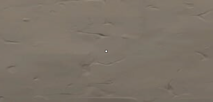
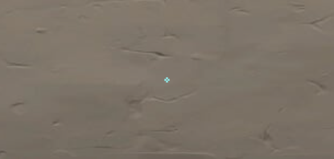
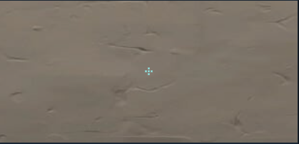
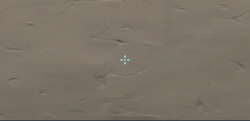
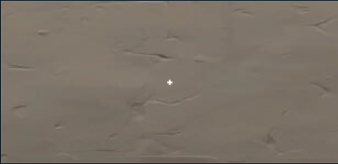

# Коллекция кастомных прицелов для Valorant

Добро пожаловать в коллекцию кастомных прицелов для игры Valorant! Ниже представлены различные варианты прицелов с их кодами и изображениями. Чтобы использовать любой из них, скопируйте соответствующий код и вставьте его в настройки прицела в игре.

---

## 1. Dot 2

**Код: 0;s;1;P;o;1;d;1;0b;0;1b;0;S;c;0;s;0.457**

**Изображение:**

---

## 2. CEMEN_BAKIN

**Код: 0;c;1;s;1;P;c;8;u;00B5FFFF;h;0;b;1;m;1;0l;2;0v;2;0o;1;0a;1;0f;0;1b;0;S;s;0.666;o;1**

**Изображение:**

---

## 3. 4 dots

**Код: 0;c;1;s;1;P;c;5;u;000000FF;h;0;d;1;f;0;m;1;0l;2;0v;3;0o;2;0a;1;0f;0;1b;0;S;s;0.666;o;1**

**Изображение:**

---

## 4. s1s1

**Код: 0;c;1;s;1;P;c;5;u;000000FF;h;0;d;1;f;0;m;1;0l;3;0v;3;0a;1;0f;0;1b;0;S;s;0.666;o;1**

**Изображение:**

---

## 5. 1220

**Код: 0;c;1;s;1;P;u;000000FF;h;0;m;1;0l;3;0v;3;0o;0;0a;1;0f;0;1b;0;S;s;0.666;o;1**

**Изображение:**

